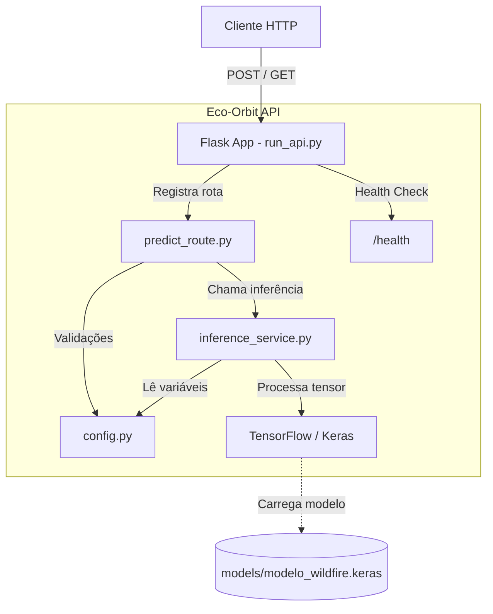

# Eco-Orbit AI — API de Detecção de Incêndios

API desenvolvida em Flask para a detecção de focos de incêndio em imagens, utilizando um modelo de Deep Learning treinado com TensorFlow/Keras. O sistema recebe imagens via requisição HTTP e retorna a probabilidade de haver fogo na imagem analisada.

---

## Integrantes do Grupo

| Nome | RM |
|---|---|
| João Victor Alves da Silva | 559726 |
| Vinícius Kenzo Tocuyosi | 559982 |
| Lucas Gomes de Araújo Lopes | 559607 |

---

## Arquitetura do Sistema

O diagrama abaixo ilustra a separação de responsabilidades da API, evidenciando o fluxo desde a requisição do cliente até a inferência no modelo de Machine Learning.


### Decisões Arquiteturais

1. **Padrão Singleton no Modelo** — O modelo do TensorFlow é carregado apenas uma vez na memória (`EcoOrbitModel._modelo`). Isso reduz o tempo de resposta das requisições, evitando a leitura em disco a cada nova predição.

2. **Fail-Fast na Inicialização** — O servidor verifica a existência do arquivo `.keras` antes de subir a aplicação (`run_api.py`). Se o modelo não for encontrado, a aplicação é encerrada imediatamente, evitando falhas silenciosas.

---

## Instruções de Uso

### 1. Pré-requisitos

Certifique-se de ter o **Python 3** instalado. Recomenda-se o uso de um ambiente virtual (`venv`). O arquivo do modelo treinado (`modelo_wildfire.keras`) deve estar presente no diretório especificado pelas configurações do projeto.

### 2. Instalação das Dependências

```bash
pip install -r requirements.txt
```

### 3. Executando o Servidor

```bash
python run_api.py
```

O servidor estará disponível em: `http://localhost:5000`

---

## Endpoints

### `GET /health` — Health Check

Verifica se a API está no ar.

**Exemplo de requisição:**
```bash
curl http://localhost:5000/health
```

**Resposta (200 OK):**
```json
{
  "status": "online",
  "service": "eco-orbit-ai"
}
```

---

### `POST /api/v1/predict` — Predição de Imagens

Envia uma imagem para análise pelo modelo.

- **Content-Type:** `multipart/form-data`
- **Parâmetro:** `imagem` — arquivo de imagem (JPG ou PNG)

**Exemplo de requisição:**
```bash
curl -X POST -F "imagem=@caminho/para/sua/imagem.jpg" http://localhost:5000/api/v1/predict
```

**Resposta (200 OK):**
```json
{
  "fogo_detectado": true,
  "confianca_percentual": 98.45,
  "arquivo_analisado": "imagem.jpg"
}
```
